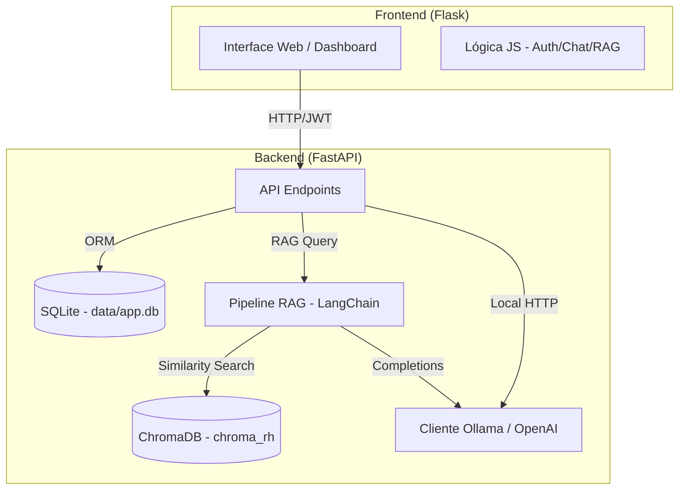

# Documentação Técnica - QA AI Platform (Versão RAG & Multi-Chat)

Este documento detalha os requisitos, arquitetura e implementação da plataforma **QA AI Platform**, uma solução de Q&A (Perguntas e Respostas) baseada em inteligência artificial generativa com suporte a RAG (Retrieval-Augmented Generation) e chat generalista.

## 1. Requisitos Funcionais (RF)

*   **RF01 - Autenticação**: Registro e login seguro de usuários via JWT, com persistência em SQLite.
*   **RF02 - Ingestão Automática**: Carregamento e processamento de documentos PDF da pasta `documentos/` em cada inicialização do servidor.
*   **RF03 - Consulta RAG**: Interface dedicada para perguntas técnicas baseadas exclusivamente no conteúdo dos regimentos carregados.
*   **RF04 - Chat Generalista**: Integração com Ollama (modelo Qwen3) para assistência geral sem dependência de documentos.
*   **RF05 - Citação de Fontes**: Exibição detalhada de metadados (nome do arquivo, página, categoria) e trechos originais em cada resposta RAG.
*   **RF06 - Gestão de Histórico**: Armazenamento de conversas por usuário, permitindo retomar chats anteriores no dashboard.
*   **RF07 - Personalização de UI**: Alternância entre temas Dark e Light e controle de streaming de respostas.

## 2. Requisitos Não Funcionais (RNF)

*   **RNF01 - Observabilidade Avançada**: Logs centralizados com ícones descritivos e saída para arquivo (`logs/backend.log`), monitorando latência e eventos críticos.
*   **RNF02 - Precisão via Reranking**: Processo de reclassificação semântica para filtrar os 4 trechos mais relevantes entre 8 recuperados inicialmente.
*   **RNF03 - Arquitetura Desacoplada**: Separação clara entre a lógica de interface (Flask) e a lógica de inteligência (FastAPI).
*   **RNF04 - Banco Vetorial de Alta Performance**: Uso do ChromaDB persistente para busca semântica veloz.

## 3. Stack Tecnológica

| Camada | Tecnologia |
| :--- | :--- |
| **Frontend** | Flask, Bootstrap 5, Vanilla JS, Marked.js (Markdown) |
| **Backend API** | FastAPI, Pydantic v2, SQLAlchemy |
| **Orquestração IA** | LangChain, LangChain-OpenAI, LangChain-Chroma |
| **Modelos (RAG)** | GPT-4o-mini (Geração), text-embedding-3-small (Vetores) |
| **Modelos (Chat)** | Ollama (Qwen3) local |
| **Banco de Dados** | SQLite (Dados), ChromaDB (Vetores) |

## 4. Arquitetura do Sistema

## 5. Fluxo de Processamento RAG

1.  **Ingestão (Startup)**: Limpeza do índice anterior -> Carga de PDFs -> Fragmentação (Chunks) -> Geração de Embeddings -> Persistência no ChromaDB.
2.  **Consulta**:
    *   **Retrieval**: Busca os 8 fragmentos mais próximos vetorialmente da pergunta.
    *   **Reranking**: O LLM avalia a relevância de cada fragmento (escala 0-10).
    *   **Generation**: Os 4 fragmentos com maior nota são enviados no prompt final para o GPT-4o-mini.
    *   **Response**: Retorno da resposta textual + Lista de fontes estruturadas.

## 6. Sistema de Monitoramento e Logs

A aplicação utiliza uma convenção de logs visuais para facilitar a auditoria:

*   🚀 **[STARTUP]**: Ciclo de vida da aplicação e carga de documentos.
*   🌐 **[REQ] / ✅ [RES]**: Fluxo de tráfego entre Frontend e Backend com tempo de resposta.
*   🧠 **[LLM]**: Tempo de resposta e modelo utilizado na geração.
*   📄 **[DOCS]**: Ingestão e listagem de arquivos da base de conhecimento.
*   🔄 **[RERANK]**: Eficácia da recuperação de trechos.
*   ❌ **[ERR]**: Rastreamento completo de exceções e falhas de conexão.

## 7. Estrutura de Testes

*   **Testes de Integração**: Localizados em `backend/tests/`, utilizam `pytest` e `pytest-mock`.
*   **Mocks de IA**: Simulam respostas da OpenAI e Ollama para permitir testes em ambientes sem internet ou sem créditos de API.
*   **Validação de Endpoints**: Cobre Autenticação, Fluxo de Chat, RAG e CRUD de Usuários.
