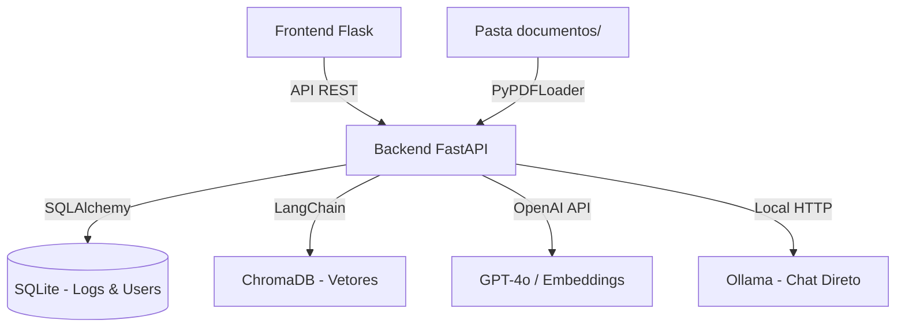

# Documentação Técnica - QA AI Platform (Versão RAG)

Este documento detalha os requisitos, arquitetura e implementação da plataforma **QA AI Platform**, uma solução de Q&A (Perguntas e Respostas) baseada em inteligência artificial generativa com suporte a RAG local e híbrido.

## 1. Requisitos Funcionais (RF)

*   **RF01 - Autenticação**: Registro e login seguro de usuários via JWT.
*   **RF02 - Ingestão de Documentos**: O sistema carrega automaticamente arquivos PDF da pasta `documentos/` em cada inicialização.
*   **RF03 - Consulta RAG**: O usuário pode fazer perguntas que são respondidas com base exclusiva no conteúdo dos documentos ingeridos.
*   **RF04 - Citação de Fontes**: Cada resposta do RAG retorna o nome do documento, a categoria semântica e o trecho exato utilizado.
*   **RF05 - Auditoria de Consultas**: Registro persistente de todas as perguntas, respostas e fontes no banco de dados.
*   **RF06 - Chat Convencional**: Opção de chat generalista (Ollama/LLM direto).

## 2. Requisitos Não Funcionais (RNF)

*   **RNF01 - Observabilidade**: Sistema de logs visual com ícones e saída dupla (Console + Arquivo `logs/backend.log`).
*   **RNF02 - Precisão (Reranking)**: Utilização de técnica de reclassificação via LLM para filtrar os trechos mais relevantes antes da geração da resposta.
*   **RNF03 - Persistência Vetorial**: Uso de ChromaDB para armazenamento e recuperação eficiente de embeddings.
*   **RNF04 - Performance de Startup**: Processamento assíncrono e limpeza inteligente de cache durante a inicialização.

## 3. Arquitetura do Sistema

## 4. Pipeline de RAG (Detalhado)

O pipeline de RAG foi construído utilizando a biblioteca **LangChain** e segue o fluxo:

1.  **Carregamento**: `PyPDFLoader` extrai texto e metadados dos arquivos.
2.  **Fragmentação**: `RecursiveCharacterTextSplitter` divide o texto em chunks de 800 caracteres com sobreposição de 150.
3.  **Embeddings**: Geração de vetores via modelo `text-embedding-3-small`.
4.  **Recuperação (Retrieval)**: Busca vetorial por similaridade (k=8).
5.  **Reclassificação (Reranking)**: O LLM avalia cada um dos 8 trechos recuperados e atribui uma nota de relevância.
6.  **Geração (Generation)**: O LLM gera a resposta final utilizando apenas os 4 melhores trechos como contexto.

## 5. Sistema de Monitoramento

O sistema de logs foi desenhado para facilitar a auditoria em tempo real:

*   🚀 **[STARTUP]**: Status da carga de banco, modelos e documentos.
*   🌐 **[REQ]**: Rastreio de cada chamada do frontend com IP do cliente.
*   📄 **[DOCS]**: Logs de carregamento de PDFs (página a página).
*   ✂️ **[CHUNKING]**: Quantidade de fragmentos gerados.
*   🔄 **[RERANK]**: Notas de relevância atribuídas pelo modelo.
*   🧠 **[LLM]**: Tempo de geração e uso dos modelos OpenAI.
*   ✅ **[RES]**: Status final da resposta e tempo total de processamento.

## 6. Qualidade e Testes

A aplicação utiliza `pytest` com uma infraestrutura de **Mocks**, permitindo validar todo o fluxo de RAG e Chat sem realizar chamadas reais à OpenAI ou depender de arquivos físicos, garantindo testes rápidos e isolados.

## 7. Conclusão

A arquitetura modular permite que a plataforma evolua de um simples chat para um sistema de inteligência documental robusto. A combinação de logs detalhados e ingestão automática garante uma experiência de desenvolvimento e manutenção facilitada.
